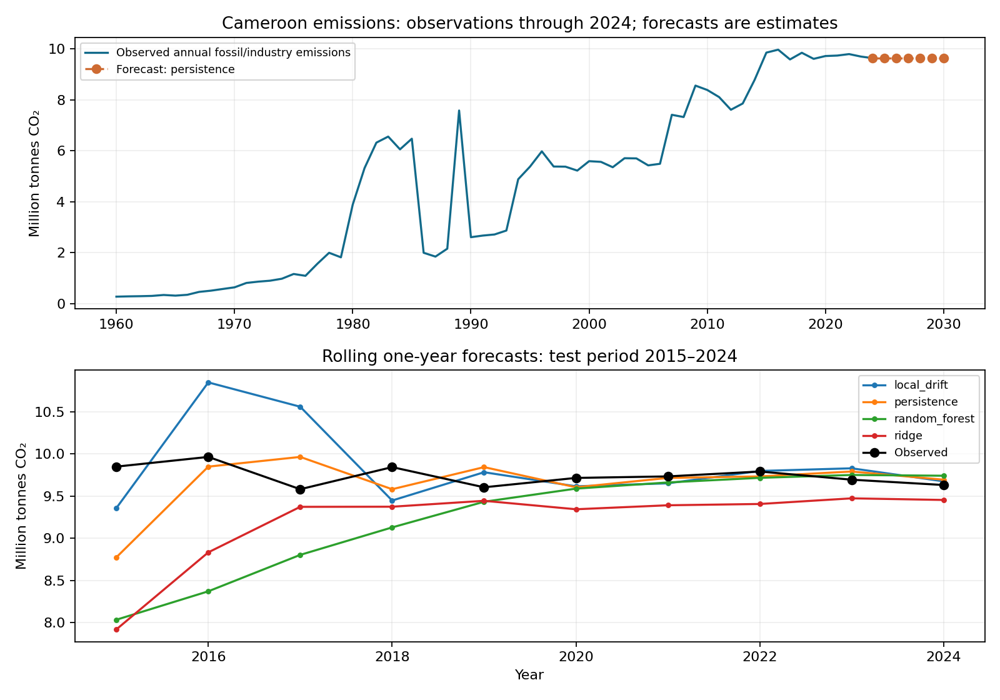

# Cameroon CO2 emissions forecasting

**Miranda Nkwikah Finjap** · Independent reproducible portfolio study · October 2026

Compare persistence, local drift, Ridge and random forest models on real annual Cameroon emissions using validation-based model choice and rolling holdout evaluation.

## Run

Use Python 3.11 or newer. From this repository directory:

```bash
python -m venv .venv
source .venv/bin/activate
pip install -r requirements.txt
python analysis.py
python -m unittest discover -s tests -v
```

Windows activation: `.venv\Scripts\activate`. Data required for the main analysis
are bundled, so the analysis runs without downloading large files.

Open [notebook.ipynb](notebook.ipynb) in Jupyter or Google Colab to read the executed
walkthrough. When using Colab, upload/extract the entire repository and change to
its directory before running the notebook. `analysis.py` is the runnable source.

## Evidence and outputs

See [results/metrics.json](results/metrics.json) for measured results, `results/`
for figures and CSV outputs, and [data/PROVENANCE.md](data/PROVENANCE.md) for
sources, units and the distinction between observations and demonstrations.
Tests target scientific failure modes, rather than merely checking that files exist.

## Findings from the completed run

Used **65 annual observations, 1960–2024**. Persistence was selected on the 2005–2014 validation period and also gave the lowest 2015–2024 test RMSE: **0.3835 Mt CO2**, compared with **0.7601** for Ridge and **0.8380** for random forest. Fixed model settings and the small dataset limit conclusions. The six-year projection stays at the last observed 2024 value, **9.632 Mt CO2/year**; it is an estimate, not an observation.



## Scope and limitations

65 annual observations; model settings are fixed rather than extensively tuned. Test results may favour a baseline. Forecasts are estimates, not known emissions, and do not support causal or clinical claims.
Developed a reproducible Cameroon CO2 forecasting study using real emissions data, lagged predictors, rolling evaluation and baseline comparisons.

## Research ownership and review

This analysis was prepared collaboratively with coding assistance. All original
observations and published results remain credited to their data providers.
The researcher should reproduce the run, inspect the figures and understand the
methods before presenting the work or extending it for publication.
This repository is a portfolio study, not a peer-reviewed article.

Contact: miranda.finjap@aims-cameroon.org
